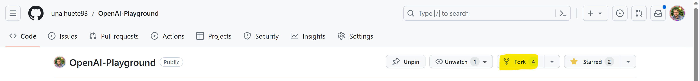
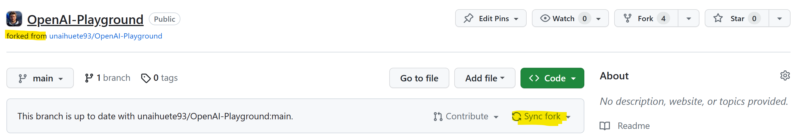
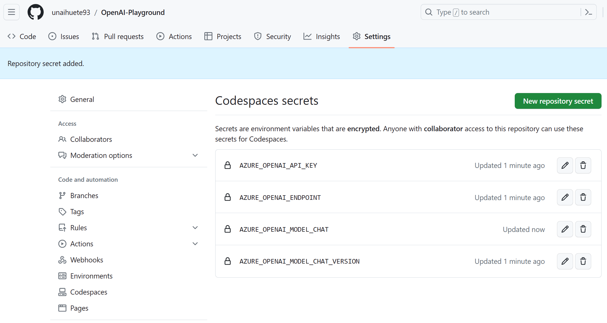
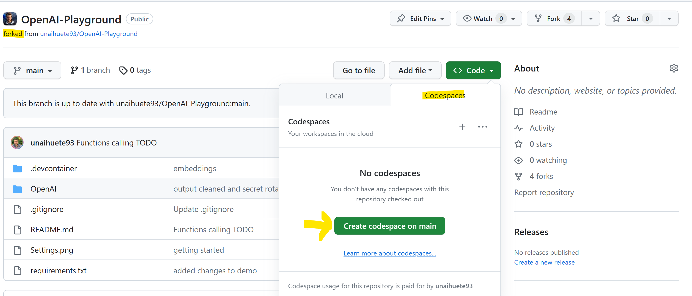

# Getting Started

## Fork the repository 

Start by forking the repository under your own account. This way you will be able to modify code if neccesary:

You can update the fork with the latest changes (more demos will be included in the future) by using the **Sync fork** option from the forked repo:

## Deploy the Azure resources
Depending on the demo selected, you will need to deploy some of the following Azure Resources (and apply the configuration settings/secrets mentioned later):
- Azure OpenAI service
- Azure Speech
- Azure Computer Vision
- Azure Search 
- Azure Document Intelligence (old Form Recognizer)

## Run in GitHub Codespace

The repository has been prepared to execute as a devcontainer (using GitHub Codespaces). You can also clone it an execute it locally if necessary tool/libraries are installed.

The devcontainer includes all the tools needed (mainly Python/Jupyter) and python libraries. You can check the deployed configuration in:
- [Devcontainer folder](.devcontainer/devcontainer.json)
- [Requirements file for Python libraries](requirements.txt)

### 1. Add GitHub Codespace secrets

Add the following secrets related to the deployed Azure resources to the GitHub Repository (Codespaces), as they are going to be used in the Demos (**some demos may require more settings**). Go to **Settings>Secrets and Variables>Codespaces**: 

For **Azure OpenAI**
- AZURE_OPENAI_API_KEY
- AZURE_OPENAI_ENDPOINT
- AZURE_OPENAI_MODEL_CHAT: In my case I used a deployment of "gpt-35-turbo"
- AZURE_OPENAI_MODEL_CHAT_VERSION : in my case I used "2023-03-15-preview"
- OPENAI_ADA_EMBEDDING_DEPLOYMENT_NAME Your "text-embedding-ada-002" model deployment name
- OPENAI_ADA_EMBEDDING_MODEL_NAME = text-embedding-ada-002

For **Azure Search**
- AZURE_SEARCH_ADMIN_KEY
- AZURE_SEARCH_SERVICE_ENDPOINT
- AZURE_COGNITIVE_SEARCH_SERVICE_NAME

For **Azure Computer Vision**
- AZURE_COMPUTER_VISION_ENDPOINT
- AZURE_COMPUTER_VISION_KEY

For **Azure Document Intelligence** (Form Recognizer)
- AZURE_DOC_ENDPOINT
- AZURE_DOC_KEY

For **Azure Speech**
- AZURE_SPEECH_KEY
- AZURE_SPEECH_REGION

### 2. Launch Codespace

> Note: GitHub offers up to 60 hours of codespace execution for free a month https://github.com/features/codespaces

From the forked repository, launch a GitHub codespace by clicking on **Code>Codespaces>Create codespace on main**:

- The GitHub codespace automatically installs all needed tools and libraries when launched. You can also find the installed libraries at the **requirements.txt** file.

    > WARNING: you can also execute "pip3 install --user -r requirements.txt" if the libraries are missing for some reason.
- For the Jupyter Notebooks, open the file and **select kernel** before running (**python 3.11 is provided**). 

- All Jupyter notebook load the Azure resource settings from Github Codespace secrets.

