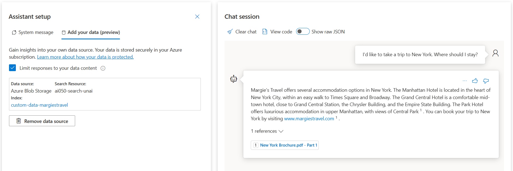

# Use your data in Azure OpenAI

Follow the instructions on this lab to customize the service: https://microsoftlearning.github.io/mslearn-openai/Instructions/Labs/06-use-own-data.html

By the end of the instructions your model should give customized answer based on the provided data:

# Call your custom data model using Python
TODO