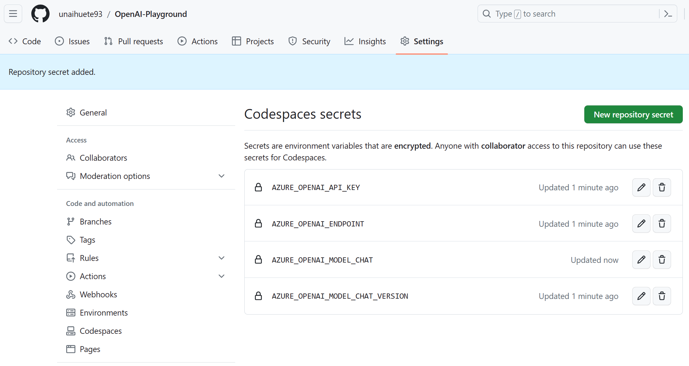

# OpenAI-Playground

## Prepared to run in GitHub Codespace (also local devcontainer)

Add the following secrets to the GitHub Repository (Codespaces), as they are going to be used in the Demos (**some demos may require more settings**):

- AZURE_OPENAI_API_KEY
- AZURE_OPENAI_ENDPOINT
- AZURE_OPENAI_MODEL_CHAT: In my case I used a deployment of "gpt-35-turbo"
- AZURE_OPENAI_MODEL_CHAT_VERSION : in my case I used "2023-03-15-preview"

## Demos 

- The GitHub codespace automatically installs all needed modules when launched, but you can also find them in the *requirements.txt* file.
    > WARNING: you can also execute "pip3 install --user -r requirements.txt" if the libraries are missing for some reason.
- For the jupiter Notebooks, open the file and **select kernel** before running. Configuration can be given in two ways:

    1. Using GitHub Codespace and secrets (as show above)
    2. Provide an ".env" file (commented in many files)

### Basics 

The following demos are provided under the [DeepLearningAI-Course](OpenAI/DeepLearningAI-Course) folder. Demos are taken from the course provided at https://learn.deeplearning.ai/chatgpt-prompt-eng/lesson/1/introduction . All Demos use **ChatCompletion** Endpoint. 

- [Getting Started](OpenAI/DeepLearningAI-Course/l2-guidelines.ipynb)
- [Iterative Prompts](OpenAI/DeepLearningAI-Course/l3-iterative-prompt-development.ipynb)
    - Create Description from Product Fact Sheet (limit words, focus on aspects, add dimension, render into an HTML page)
- [Summarizing](OpenAI/DeepLearningAI-Course/l4-summarizing.ipynb)
    - Summarize various product reviews in a single prompt
- [Inferring](OpenAI/DeepLearningAI-Course/l5-inferring.ipynb)
    - Analyze text sentiment, emotions, identify anger (product review), extract product information, ...
- [Transforming](OpenAI/DeepLearningAI-Course/l6-transforming.ipynb)
    - Translate single and multiple languages, using different tones
    - Format conversion (JSON to HTML)
    - Grammar checks
- [Expanding](OpenAI/DeepLearningAI-Course/l7-expanding.ipynb)
    - Automate email reply to customers reviews
- [ChatBot](OpenAI/DeepLearningAI-Course/l8-chatbot.ipynb)
    - Provide multiple messages (with roles), to the "ChatCompletion" call.
    - Pizza ordering Bot sample

### Intermediate

- [Speech Summarizing with OpenAI and Azure Speech AI](OpenAI/Speech-Summarize/Speech-summarizing.ipynb) taken & modified from [repo](https://github.com/retkowsky/Azure-OpenAI-demos/blob/main/Azure%20Open%20AI%20quick%20demos)
- [Open AI and Azure Document Intelligence](OpenAI/Document-Intelligence/Document-Intelligence.ipynb) taken & modified from [repo](https://github.com/retkowsky/Azure-OpenAI-demos/blob/main/Azure%20Open%20AI%20quick%20demos)
- [Gradio webapp with Azure ChatGPT]() taken & modified from [repo](https://github.com/retkowsky/Azure-OpenAI-demos/blob/main/Azure%20Open%20AI%20quick%20demos)
- [Movie recommender with Azure Open AI & Azure Cognitive Search]() taken & modified from [repo](https://github.com/retkowsky/Azure-OpenAI-demos/blob/main/Azure%20Open%20AI%20quick%20demos)
    - Part 1:  Embeddings generation with Azure Open AI and Azure Cognitive Search ingestion
    - Part 2: Search examples
    - Part 3: Recommandations
    

### WARNING:  If you get issues related to Large Files in Git run the following in the Codespace Terminal

1. Add Git LFS Repository:
You'll need to add the Git LFS repository to your package manager's sources list. Open a terminal and run the following commands:

    curl -s https://packagecloud.io/install/repositories/github/git-lfs/script.deb.sh | sudo bash
    This command fetches and runs a script that adds the Git LFS repository to your package manager.

1. Update Package Lists:
After adding the repository, update your package lists:

    sudo apt-get update

1. Install Git LFS:
Now that the repository is added and the package lists are updated, you can install Git LFS:

    sudo apt-get install git-lfs
1. Initialize Git LFS:
After installing Git LFS, initialize it for your Git repositories by running:

    git lfs install

1. Track Large Files:
Track the large files in your repository as needed using git lfs track, as mentioned in the previous response.

    git lfs track "*.xlsx"
    git lfs track "*.pkl"